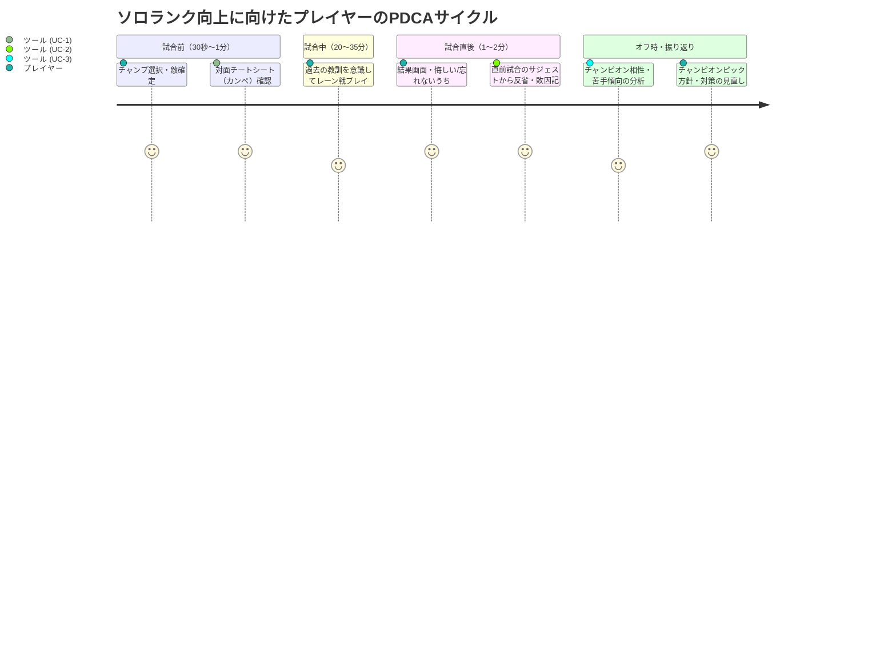

# ユースケース整理とUI/データ設計方針

本ツールは「**プレイヤー自身がソロランクでLPを上げる（勝率を改善する）ためのパーソナルPDCAツール**」です。
一般的な統計サイト（OP.GG等）のような「全プレイヤーの平均データ」ではなく、「**自分自身の成功・失敗パターン、対面別の癖、過去の教訓**」を蓄積し、活用することを目的とします。

---

## 1. プレイヤーの行動サイクルと3大コア・ユースケース

LoLプレイヤーの行動時間軸に合わせ、3つの主要ユースケースを定義します。



---

### 【UC-1】試合前 30秒：対面対策カンペ（チートシート）の確認
- **タイミング**: チャンピオンセレクト中〜ロード画面（残り30秒〜1分）
- **プレイヤーの思考**:
  > 「Renektonをピックしたが、敵対面がGarenになった。過去に1勝3敗と苦手意識がある。自分はどう戦って勝った/負けたっけ？ Lv1〜3で絶対やってはいけないNG行動は何だっけ？」
- **課題**:
  - 試合前の時間は数十秒しかない。細かいデータや過去の試合ログを読み込む余裕はない。
  - **「過去の自分が残した教訓」と「勝った時のビルド・ルーン」だけを最速で頭に入れたい**。
- **欲しいデータ種別**:
  1. **対面相性サマリ**: 自信度・難易度（Hard/Even/Easy）、過去の対面勝率
  2. **自分への教訓メモ（箇条書き）**: 「Lv1は絶対にウェーブを押さない」「相手がE使った後のCD中にトレード」「忍び足袋（スチールキャップ）直行」
  3. **勝利時/推奨セットアップ**: 推奨キーストン（Conqueror vs PTA）、初手アイテム（ドランブレード vs ドランシールド）
- **求められるUI要件**:
  - **1秒で到達できるカンペモード**: 相手チャンプ名を選択または検索するだけで即展開。
  - **ミニマル＆高可読性**: 不要な文字・数字は排し、大きなフォントの箇条書きとアイコンでパッと見で頭に入るレイアウト。

---

### 【UC-2】試合直後 1分：素早い反省・要因の記録（クイック入力）
- **タイミング**: 試合終了直後（クライアントのリザルト画面を見た直後）
- **プレイヤーの思考**:
  > 「Renekton vs Jaxでレーン戦ボコボコにされて負けた。悔しい！ 記憶が鮮明なうちに『相手の反撃（E）があるのに突っ込んだ』『Lv2先行されてソロキルされた』ことを記録しておきたい」
- **課題**:
  - 試合直後は疲労や感情の揺れがあり、長文を書くのは面倒で挫折しやすい。
  - **10秒〜30秒、数回のタップと1行のメモでサクッと記録できること**が必須。
- **欲しいデータ種別**:
  1. **直前試合の自動取得**: 勝敗、対面チャンプ、KDA、CS、試合時間
  2. **定型要因タグ（ワンタップ選択）**:
     - *レーン戦ミス*: `Lv1-3ソロキル被弾`, `Lv2/3先行被弾`, `スキルCD中トレード負け`, `ウェーブフリーズ失敗`, `タワー下ダイブ被弾`
     - *マクロ・視界ミス*: `ガンク被弾（ワーディング不足）`, `リコールタイミングミス`, `寄りの遅れ`, `集団戦立ち回り`
     - *ビルドミス*: `初手アイテム選択ミス`, `防具購入遅れ`
  3. **自由記述メモ（1行）**: 具体的な気付き（例: 「JaxがE回したらすぐダッシュで引く」）
  4. **難易度タグ**: Hard / Even / Easy
- **求められるUI要件**:
  - **プロアクティブなサジェスト**: アプリを開いたトップに「直前の試合（vs Jax: 敗北）」がカード表示され、「振り返りを入力」ボタンが点滅。
  - **タグ選択チップス**: テキストを打たなくても、要因タグを2〜3個タップするだけで大枠が記録できるUI。

---

### 【UC-3】プレイ外・週末：チャンピオン相性・苦手パターンの総合分析
- **タイミング**: その日のランク終了後、または週末の振り返り
- **プレイヤーの思考**:
  > 「最近Renektonで勝率が伸び悩んでいる。どの相手に負け越しているのか？ 共通する敗因は何なのか？ Jaxを出した方がいい相手は誰か？」
- **課題**:
  - 自分の「真の弱点（チャンピオン単位、要因単位）」を可視化したい。
- **欲しいデータ種別**:
  1. **チャンピオン別対面マトリクス**:
     - 試合数順、勝率順、難易度（Hard比率）順のソート
     - 平均KDA、平均分間CS、平均ゴールド差
  2. **要因・敗因の集計グラフ**:
     - 「Renektonで負けた試合の60%は『ガンク被弾』が原因」といったパターンの可視化
  3. **試合ドリルダウン（詳細履歴）**:
     - 過去の試合ごとのアイテム進行、対戦日、詳細メモ一覧
- **求められるUI要件**:
  - **Google風クリーンダッシュボード**: 情報過多にならず、要点（天敵ワースト3、得意ベスト3）がカード形式で俯瞰できる。
  - **アコーディオン/詳細ビュー**: 気になる対面をクリックすればその場ですべての過去試合とメモが展開。

---

## 2. ユースケース × 必要データ種別 × データソース

| データ種別 | 内容 | ソース | 主な用途 |
| :--- | :--- | :--- | :--- |
| **基本試合データ** | 勝敗、チャンピオン、対面チャンピオン、KDA、CS、試合時間、サモスペ、最終アイテム | Riot API (Match-V5) | 全UC共通の基礎データ |
| **ユーザー主観データ** | 難易度タグ (Hard/Even/Easy)、自由記述メモ、更新日時 | ローカルDB (MatchNote) | UC-1(カンペ), UC-2(反省), UC-3(分析) |
| **要因・敗因タグ** | ソロキル被弾、ガンク被弾、ウェーブ管理、スキルCD等 | ローカルDB (タグ構造) | UC-2(クイック入力), UC-3(弱点傾向分析) |
| **レーン戦スタッツ (拡張検討)** | 10分/15分時点のCS差、ゴールド差、被ソロキル回数 | Riot API (Match-Timeline-V5) | UC-2(客観的反省), UC-3(レーン戦実力評価) |

---

## 3. UI画面構成と情報設計（ワイヤーフレーム構想）

Google風のシンプルでノイズのないUIをベースに、以下の主要コンポーネントで構成します。

```
+-------------------------------------------------------------------------------+
|  Header: [LoL Matchup Lab]               [ Sunny9#hono (Solo/Duo) 検索 ]      |
+-------------------------------------------------------------------------------+
|                                                                               |
|  [! 直前の試合サジェスト] (未記録の反省がある場合のみハイライト表示)                 |
|  +-------------------------------------------------------------------------+  |
|  | vs Jax (敗北 - 28分)  KDA: 2/6/3  CS: 6.8/m                                |  |
|  | 「まだ振り返りメモがありません」 [ 反省・要因をサクッと記録する (1クリック) ]    |  |
|  +-------------------------------------------------------------------------+  |
|                                                                               |
|  [自チャンプセレクタ]: [ Renekton (18試合 / 61.1%) ▼ ]  [ Jax (14試合) ]       |
|                                                                               |
|  +---------------------------+  +------------------------------------------+  |
|  | 🚨 要警戒・天敵 (勝率低)   |  | 🏆 得意対面 (勝率高)                      |  |
|  | vs Garen (1勝3敗 / 25.0%) |  | vs Aatrox (4勝0敗 / 100%)                |  |
|  | メモ: Lv1-3は触らない      |  | メモ: Q3をEで躱してインファイト          |  |
|  +---------------------------+  +------------------------------------------+  |
|                                                                               |
|  [対面一覧 & カンペ検索] [ 相手チャンプを絞り込み... (例: Garen) ]  [並び順: 試合数▼] |
|  +-------------------------------------------------------------------------+  |
|  | [Garen]  1勝3敗 (25%) | KDA: 1.5 | CS: 7.1 | [Hard x3]                   |  |
|  | 最新メモ: 「相手のQを受けた後にWスタンを入れる。沈黙中は無駄に殴らない」     |  |
|  | [ カンペを開く (全画面) ]  [ 過去試合履歴を展開 ▼ ]                          |  |
|  +-------------------------------------------------------------------------+  |
|  | [Aatrox] 4勝0敗 (100%)| KDA: 3.8 | CS: 8.2 | [Easy x3, Even x1]         |  |
|  +-------------------------------------------------------------------------+  |
+-------------------------------------------------------------------------------+
```
